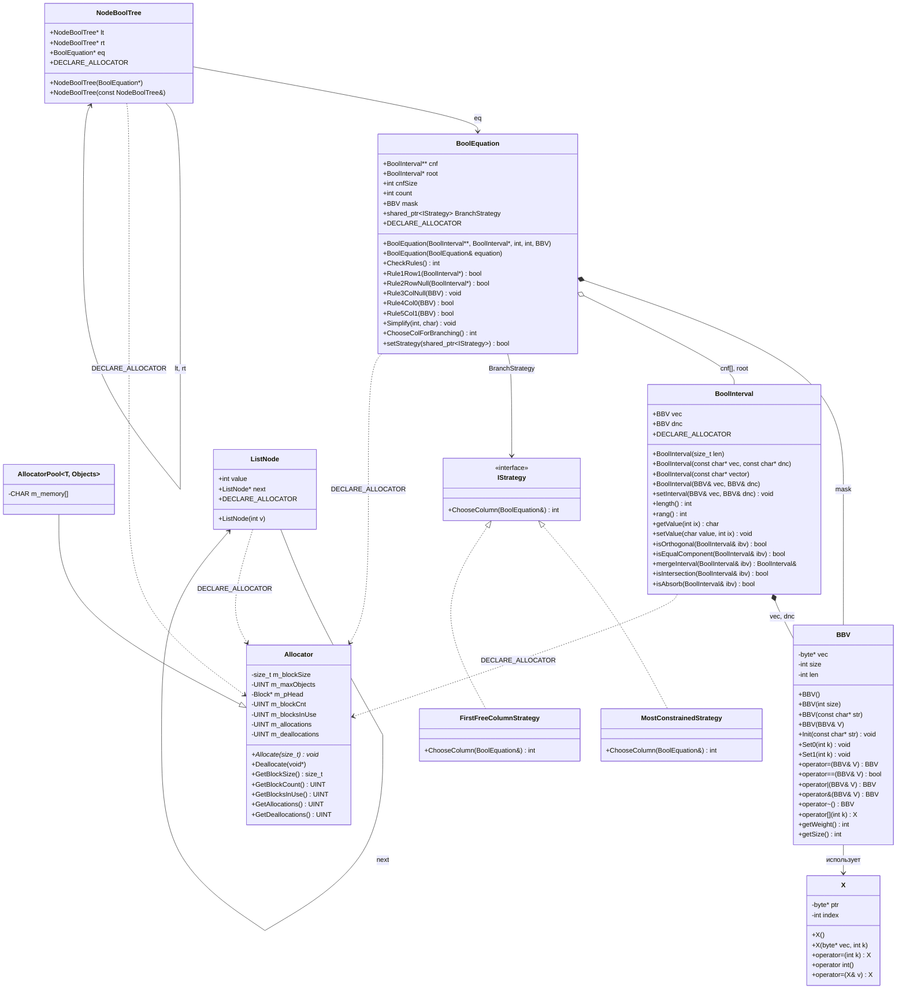

# Интеграция механизма выделения памяти

Лабораторная работа №2. Интеграция аллокатора с фиксированными блоками (Allocator-master)
в SAT-решатель на основе алгоритма DPLL. Реализован паттерн Стратегия для выбора
переменной ветвления. Проведён статический анализ кода инструментом clang-tidy.

## UML-диаграмма классов

## Структура проекта

- `Allocator-master/` — аллокатор с фиксированными блоками, эксперименты
- `SAT_DPLL/` — DPLL-решатель булевых уравнений с интегрированным аллокатором
- `analysis_report.txt` — отчёт по статическому анализу clang-tidy
